---
## Front matter
title: "Отчёт по Лабораторной работе №5"
subtitle: "Дисцилина: Архитектура компьютера"
author: "Гозенко А.С."

## Generic otions
lang: ru-RU
toc-title: "Содержание"

## Bibliography
bibliography: bib/cite.bib
csl: pandoc/csl/gost-r-7-0-5-2008-numeric.csl

## Pdf output format
toc: true # Table of contents
toc-depth: 2
lof: true # List of figures
lot: false # List of tables
fontsize: 12pt
linestretch: 1.5
papersize: a4
documentclass: scrreprt
## I18n polyglossia
polyglossia-lang:
  name: russian
  options:
	- spelling=modern
	- babelshorthands=true
polyglossia-otherlangs:
  name: english
## I18n babel
babel-lang: russian
babel-otherlangs: english
## Fonts
mainfont: PT Serif
romanfont: PT Serif
sansfont: PT Sans
monofont: PT Mono
mainfontoptions: Ligatures=TeX
romanfontoptions: Ligatures=TeX
sansfontoptions: Ligatures=TeX,Scale=MatchLowercase
monofontoptions: Scale=MatchLowercase,Scale=0.9
## Biblatex
biblatex: true
biblio-style: "gost-numeric"
biblatexoptions:
  - parentracker=true
  - backend=biber
  - hyperref=auto
  - language=auto
  - autolang=other*
  - citestyle=gost-numeric
## Pandoc-crossref LaTeX customization
figureTitle: "Рис."
tableTitle: "Таблица"
listingTitle: "Листинг"
lofTitle: "Список иллюстраций"
lotTitle: "Список таблиц"
lolTitle: "Листинги"
## Misc options
indent: true
header-includes:
  - \usepackage{indentfirst}
  - \usepackage{float} # keep figures where there are in the text
  - \floatplacement{figure}{H} # keep figures where there are in the text
---

# Цель работы

Цель данной лабораторной работы - приобретение практичесикх навыков работы в Midnight Commander и освоение инструкций яхыка ассемблера mov и int.

# Выполнение лабораторной работы

Открыл Midnight Commander, перешёл в каталог arch-pc и создал каталог lab05(рис. @fig:001).

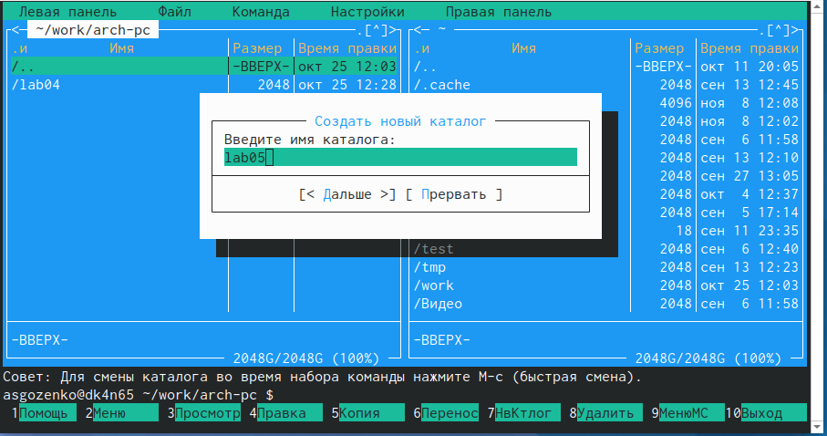{#fig:001 width=70%}

Перешёл в каталог и создал файл lab5-1.asm(рис. @fig:002).

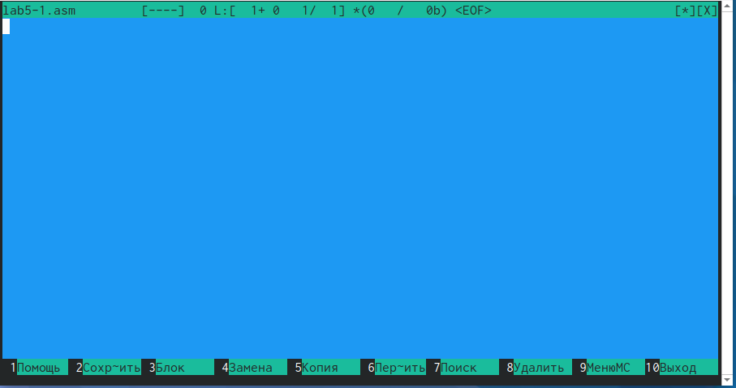{#fig:002 width=70%}

Открыл созданный файл и переписал в него программу из ТУИС(рис. @fig:003).

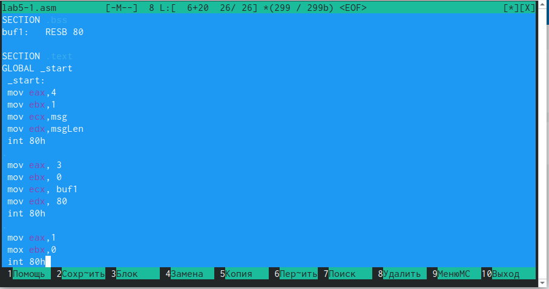{#fig:003 width=70%}

Сохранил файл(рис. @fig:004).

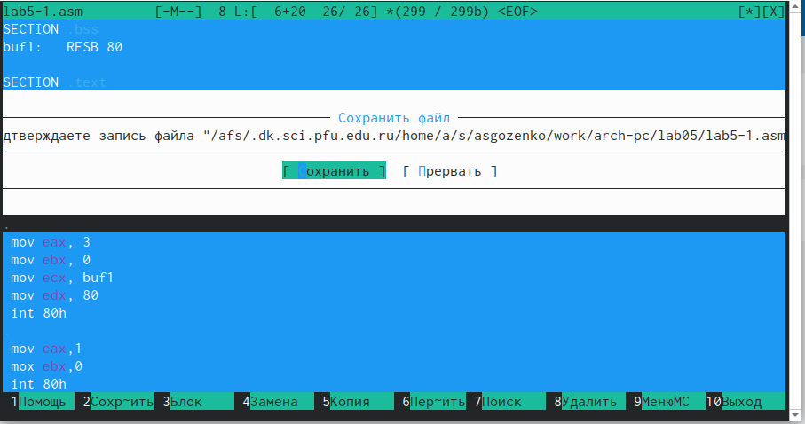{#fig:004 width=70%}

Создаю объектный файл, выполняю его компановку и запускаю исполняемый файл(рис. @fig:005).

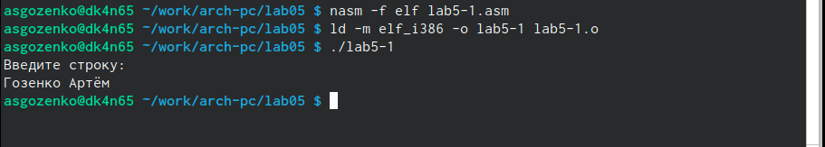{#fig:005 width=70%}

Скачиваю файл in_out.asm и переношу его в директорию lab05.(рис. @fig:006).

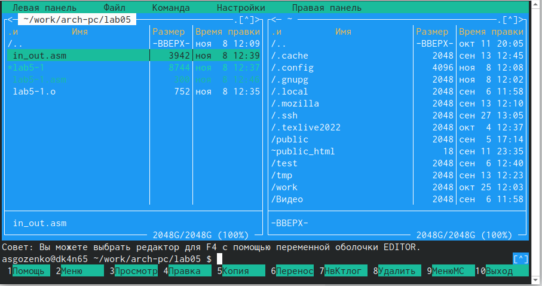{#fig:006 width=70%}

Копирую файл lab5-1.asm в lab5-2.asm и вношу изменения в программу(рис. @fig:007).

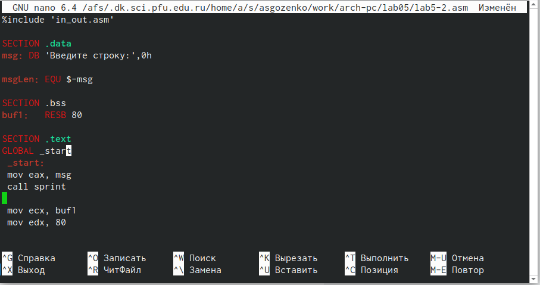{#fig:007 width=70%}

Создаю объектный файл, выполняю его компановку и запускаю исполняемый файл(рис. @fig:008).

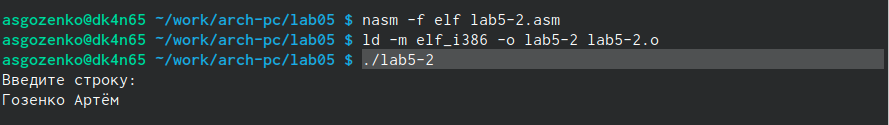{#fig:008 width=70%}

В тексте программы lab5-2.asm заменяю sprintLF на sprint и запускаю программу(рис. @fig:009). Теперь ввод производится на той же строке, что и вывод, убран символ переводастроки после вывода.

{#fig:009 width=70%}

# Выполнениезаданий для самостоятельной работы

1. Копирую файл lab5-1.asm в lab5-3.asm и именяю код программы, добавляя вывод введённой строки. Создаю объектный файл, выполняю его компановку и запускаю исполняемый файл(рис. @fig:010). 

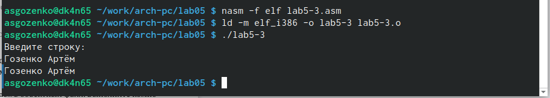{#fig:010 width=70%}

Код программы из Пункта 1:
SECTION .data 
msg: DB 'Введите строку:',10 

msgLen: EQU $-msg 

SECTION .bss 
buf1: RESB 80 

SECTION .text 
GLOBAL _start 
_start:

mov eax,4 
mov ebx,1
mov ecx,msg 
mov edx,msgLen 
int 80h 

mov eax, 3 
mov ebx, 0 
mov ecx, buf1 
mov edx, 80 
int 80h 

mov eax,4 
mov ebx,1
mov ecx, buf1
mov edx, buf1
int 80h
mov eax, 1
mov ebx, 0
int 80h

2. Копирую файл lab5-2.asm в lab5-4.asm(рис. @fig:011). 

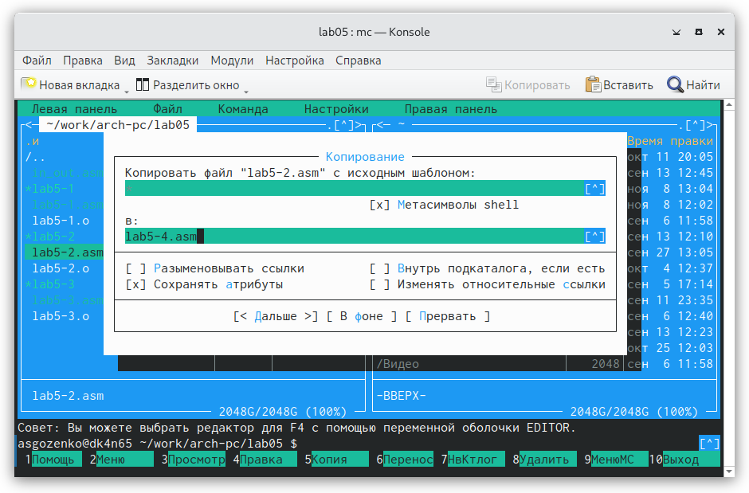{#fig:011 width=70%}

Вношу изменения в код программы, чтобы добавить вывод введённой строки.(рис. @fig:012). 

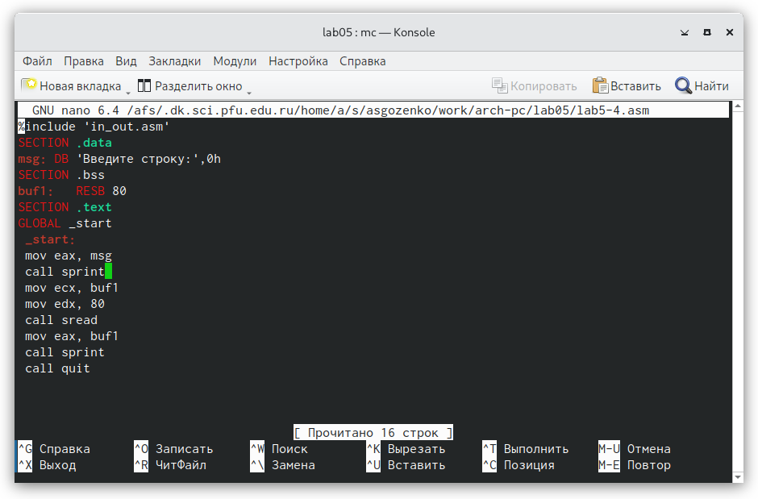{#fig:012 width=70%}

Создаю объектный файл, выполняю его компановку и запускаю исполняемый файл(рис. @fig:013). 

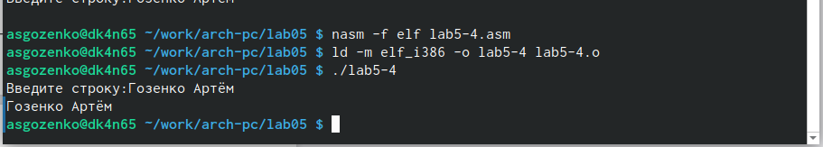{#fig:013 width=70%}

Код программы из пункта 2:
%include 'in_out.asm'
SECTION .data
msg: DB 'Введите строку:',0h
SECTION .bss
buf1:   RESB 80
SECTION .text
GLOBAL _start
 _start:
 mov eax, msg
 call sprint 
 mov ecx, buf1
 mov edx, 80
 call sread
 mov eax, buf1
 call sprint
 call quit

# Выводы

Я приобрёл практические навыки работы в Midnight Comander и освоил инструкции языка ассемблера mov и int.

