---
## Front matter
title: "Отчёт по Лабораторной работе №6"
subtitle: "Дисцилина: Архитектура компьютера"
author: "Гозенко А.С."

## Generic otions
lang: ru-RU
toc-title: "Содержание"

## Bibliography
bibliography: bib/cite.bib
csl: pandoc/csl/gost-r-7-0-5-2008-numeric.csl

## Pdf output format
toc: true # Table of contents
toc-depth: 2
lof: true # List of figures
lot: false # List of tables
fontsize: 12pt
linestretch: 1.5
papersize: a4
documentclass: scrreprt
## I18n polyglossia
polyglossia-lang:
  name: russian
  options:
	- spelling=modern
	- babelshorthands=true
polyglossia-otherlangs:
  name: english
## I18n babel
babel-lang: russian
babel-otherlangs: english
## Fonts
mainfont: PT Serif
romanfont: PT Serif
sansfont: PT Sans
monofont: PT Mono
mainfontoptions: Ligatures=TeX
romanfontoptions: Ligatures=TeX
sansfontoptions: Ligatures=TeX,Scale=MatchLowercase
monofontoptions: Scale=MatchLowercase,Scale=0.9
## Biblatex
biblatex: true
biblio-style: "gost-numeric"
biblatexoptions:
  - parentracker=true
  - backend=biber
  - hyperref=auto
  - language=auto
  - autolang=other*
  - citestyle=gost-numeric
## Pandoc-crossref LaTeX customization
figureTitle: "Рис."
tableTitle: "Таблица"
listingTitle: "Листинг"
lofTitle: "Список иллюстраций"
lotTitle: "Список таблиц"
lolTitle: "Листинги"
## Misc options
indent: true
header-includes:
  - \usepackage{indentfirst}
  - \usepackage{float} # keep figures where there are in the text
  - \floatplacement{figure}{H} # keep figures where there are in the text
---

# Цель работы

Цель данной работы - освоение арифметических инструкций языка ассемблера NASM.

# Выполнение лабораторной работы

Создание каталога, переход в него и создание файла lab6-1.asm (рис. @fig:001).

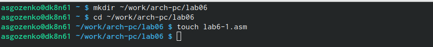{#fig:001 width=70%}

Ввод в файл lab6-1.asm программы из листинга 6.1 (рис. @fig:002).

{#fig:002 width=70%}

Создание исполнительного файла и его запуск (рис. @fig:003).

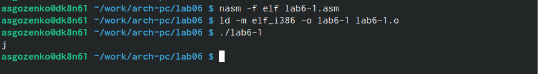{#fig:003 width=70%}

Изменение текста программы (рис. @fig:004).

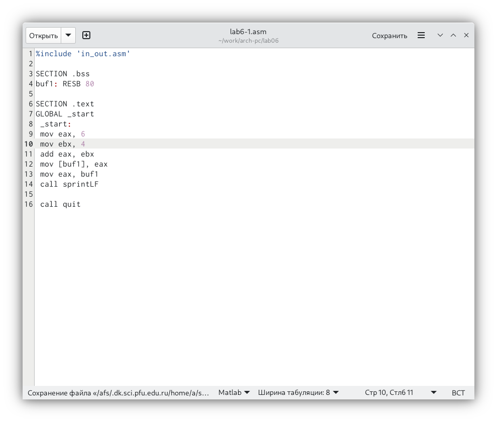{#fig:004 width=70%}

Создание исполнительного файла и его запуск (рис. @fig:005).

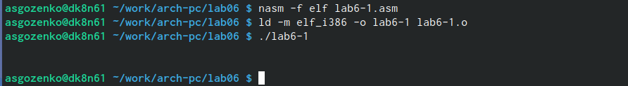{#fig:005 width=70%}

Определение выведенного программой символа в таблице ASKII (рис. @fig:006).

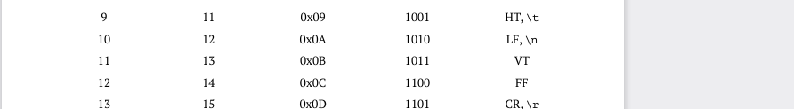{#fig:006 width=70%}

Ввод программы из листинга 6.2 в файл lab6-2.asm (рис. @fig:007).

{#fig:007 width=70%}

Создание файла lab6-2.asm, его исполнительного файла и запуск (рис. @fig:008).

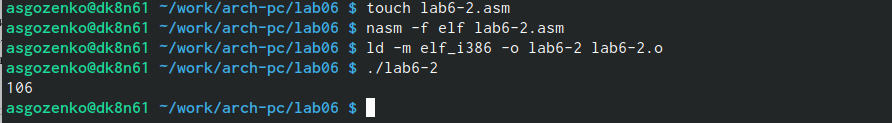{#fig:008 width=70%}

Изменение файла lab6-2.asm(рис. @fig:009).

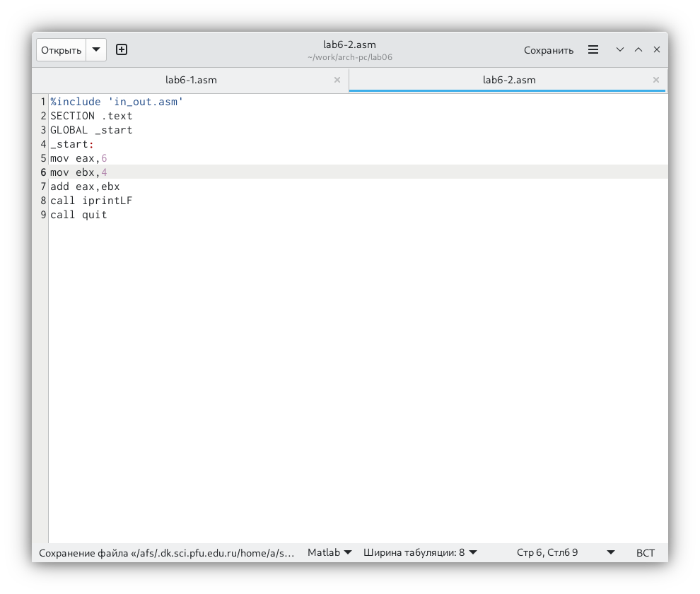{#fig:009 width=70%}

Создание исполнительного файла и его запуск (рис. @fig:010).

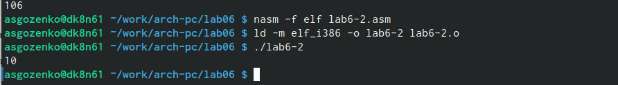{#fig:010 width=70%}

Изменение файла lab6-2.asm(рис. @fig:011).

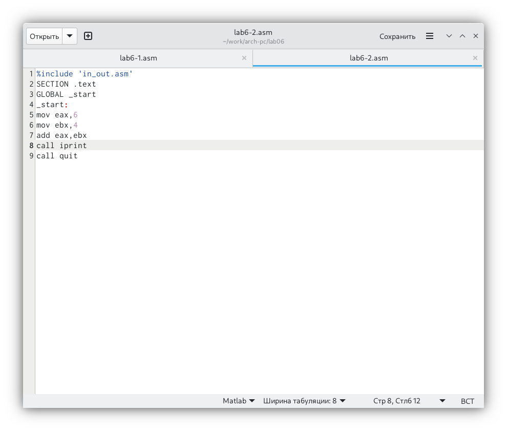{#fig:011 width=70%}
Изменился вывод информации, теперь нет отступа строки.

Создание исполнительного файла и его запуск(рис. @fig:012).

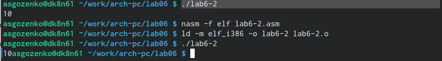{#fig:012 width=70%}

Ввод программы из листинга 6.3 в файл lab6-3.asm (рис. @fig:013).

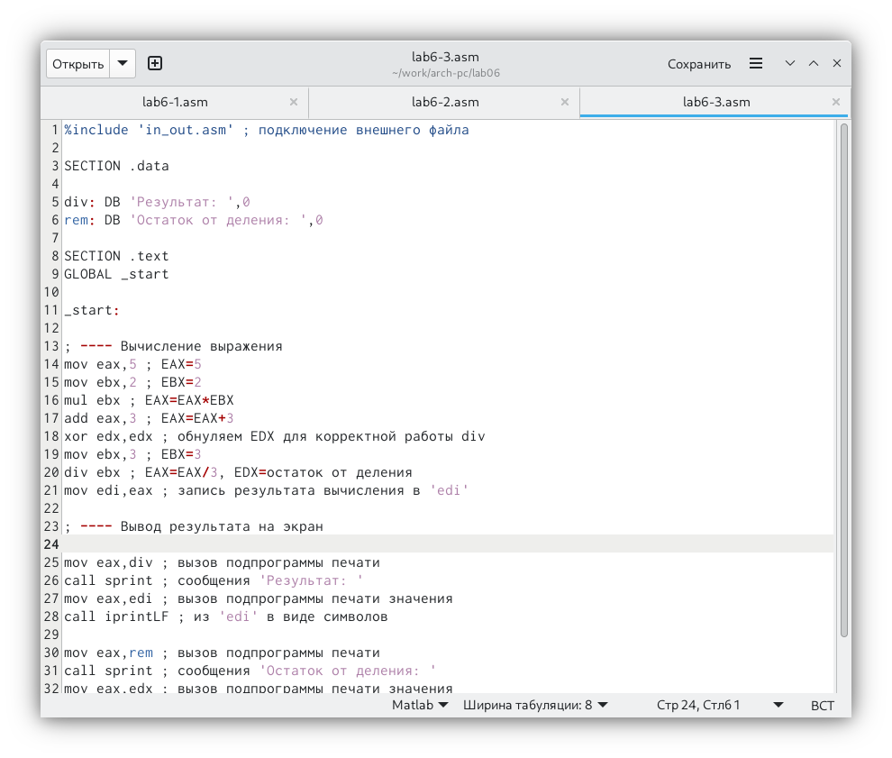{#fig:013 width=70%}

Создание исполнительного файла и его запуск(рис. @fig:014).

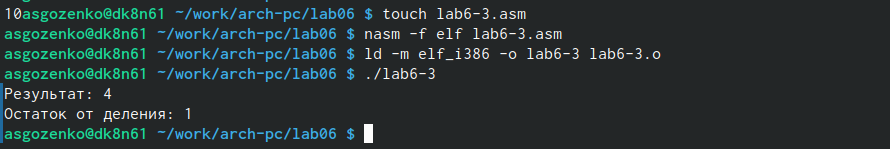{#fig:014 width=70%}

Изменение файла lab6-3.asm(рис. @fig:015).

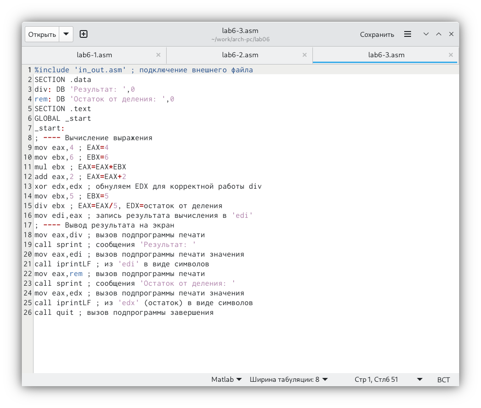{#fig:015 width=70%}

Создание исполнительного файла и его запуск(рис. @fig:016).

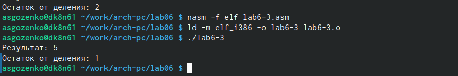{#fig:016 width=70%}

Изменение файла variant.asm(рис. @fig:017).

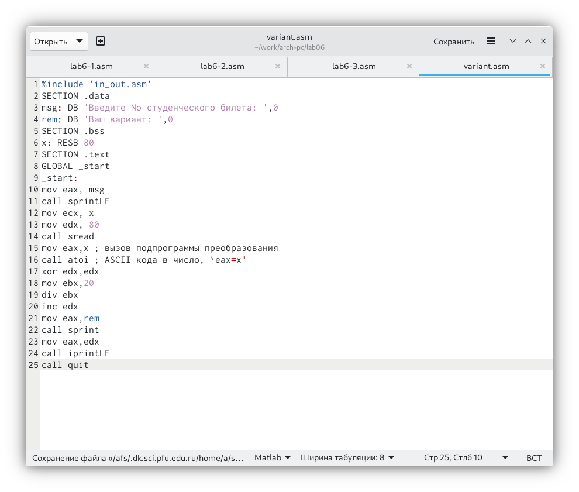{#fig:017 width=70%}

Создание исполнительного файла и его запуск(рис. @fig:018).

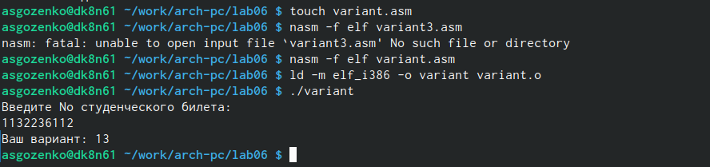{#fig:018 width=70%}

Ответы на вопросы:
1. За вывод сообщение "Ваш вариант" отвечают строки:
mov eax, rem
call sprint

2. Инструкция mov ecx, x используется, чтобы положить адрес вводимой строки х в регистр ecx mov edx, 80 - запись в регистр edx длины вводимой строки call sread - вызов подпрограммы из внешнего файла, обеспечивающий ввод собщения с клавиатуры.

3. call atoi используется для вызова подпрограммы из внешнего файла, которая прообразует askii-код символа в целое число и записывает результат в регистр eax.

4. За вычисление варианта отвечают строки:
xor edx,edx
mov ebx,20
div ebx
inc edx

5. При выполнении инструкции div ebx остаток от деления записывается в регистр edx.

6. инструкция inc edx увеличивает значение регистра edx на 1.

7. За вывод на экран резултатов вычислений отвечают строки:
mov eax,edx
call iprintLF

# Выполнение задания для самостоятельной работы.

Написание программы для вычисления значения функции (8𝑥 + 6) ⋅ 10 (рис. @fig:019).

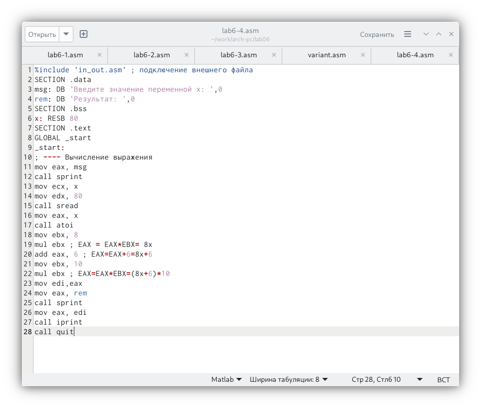{#fig:019 width=70%}

Создание исполнительного файла и его запуск(рис. @fig:020).

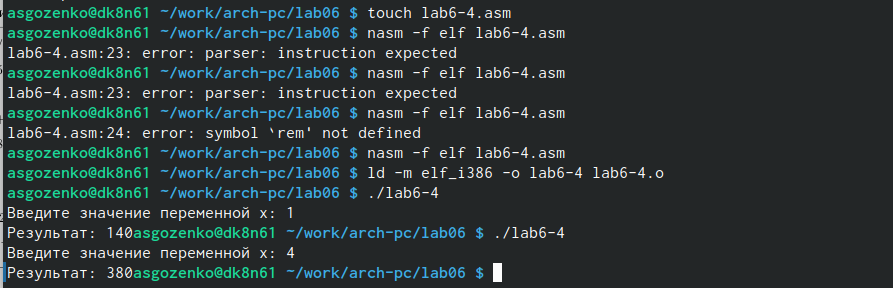{#fig:020 width=70%}

Код программы: 
%include 'in_out.asm' ; подключение внешнего файла
SECTION .data
msg: DB 'Введите значение переменной x: ',0
rem: DB 'Результат: ',0
SECTION .bss
x: RESB 80
SECTION .text
GLOBAL _start
_start:
; ---- Вычисление выражения
mov eax, msg
call sprint
mov ecx, x
mov edx, 80
call sread
mov eax, x
call atoi
mov ebx, 8
mul ebx ; EAX = EAX*EBX= 8x
add eax, 6 ; EAX=EAX+6=8x+6
mov ebx, 10
mul ebx ; EAX=EAX*EBX=(8x+6)*10
mov edi,eax
mov eax, rem
call sprint
mov eax, edi
call iprint
call quit

# Выводы

При выполнении данной лабораторной работы я освоил арифметические инструкции языка ассемблера NASM.

