---
## Front matter
title: "Отчёт по Лабораторной работе №7"
subtitle: "Дисцилина: Архитектура компьютера"
author: "Гозенко А.С."

## Generic otions
lang: ru-RU
toc-title: "Содержание"

## Bibliography
bibliography: bib/cite.bib
csl: pandoc/csl/gost-r-7-0-5-2008-numeric.csl

## Pdf output format
toc: true # Table of contents
toc-depth: 2
lof: true # List of figures
lot: false # List of tables
fontsize: 12pt
linestretch: 1.5
papersize: a4
documentclass: scrreprt
## I18n polyglossia
polyglossia-lang:
  name: russian
  options:
	- spelling=modern
	- babelshorthands=true
polyglossia-otherlangs:
  name: english
## I18n babel
babel-lang: russian
babel-otherlangs: english
## Fonts
mainfont: PT Serif
romanfont: PT Serif
sansfont: PT Sans
monofont: PT Mono
mainfontoptions: Ligatures=TeX
romanfontoptions: Ligatures=TeX
sansfontoptions: Ligatures=TeX,Scale=MatchLowercase
monofontoptions: Scale=MatchLowercase,Scale=0.9
## Biblatex
biblatex: true
biblio-style: "gost-numeric"
biblatexoptions:
  - parentracker=true
  - backend=biber
  - hyperref=auto
  - language=auto
  - autolang=other*
  - citestyle=gost-numeric
## Pandoc-crossref LaTeX customization
figureTitle: "Рис."
tableTitle: "Таблица"
listingTitle: "Листинг"
lofTitle: "Список иллюстраций"
lotTitle: "Список таблиц"
lolTitle: "Листинги"
## Misc options
indent: true
header-includes:
  - \usepackage{indentfirst}
  - \usepackage{float} # keep figures where there are in the text
  - \floatplacement{figure}{H} # keep figures where there are in the text
---

# Цель работы

Изучение команд усовного и безусовного переходов ассемблера NASM. Приобретение навыков написания программ с использованием переходов.

# Выполнение лабораторной работы

Создание каталога для лабораторнай работы, переход в него и создание файла lab7-1.asm (рис. @fig:001).

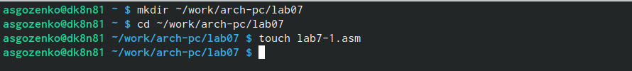{#fig:001 width=70%}

Написание программы из листинга 7.1 (рис. @fig:002).

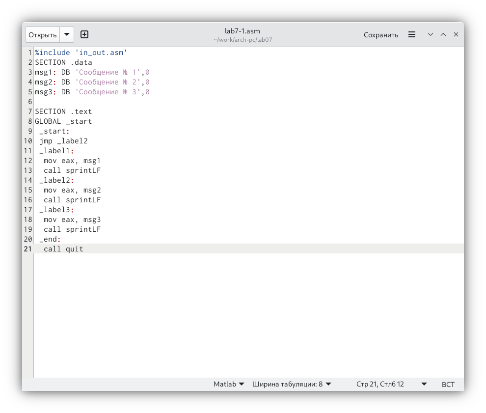{#fig:002 width=70%}

Работа программы из листинга 7.1(рис. @fig:003).

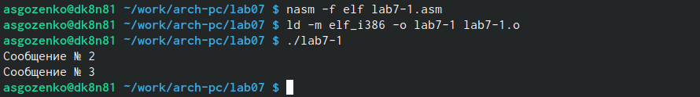{#fig:003 width=70%}

Изменение программы из листинга 7.1(рис. @fig:004).

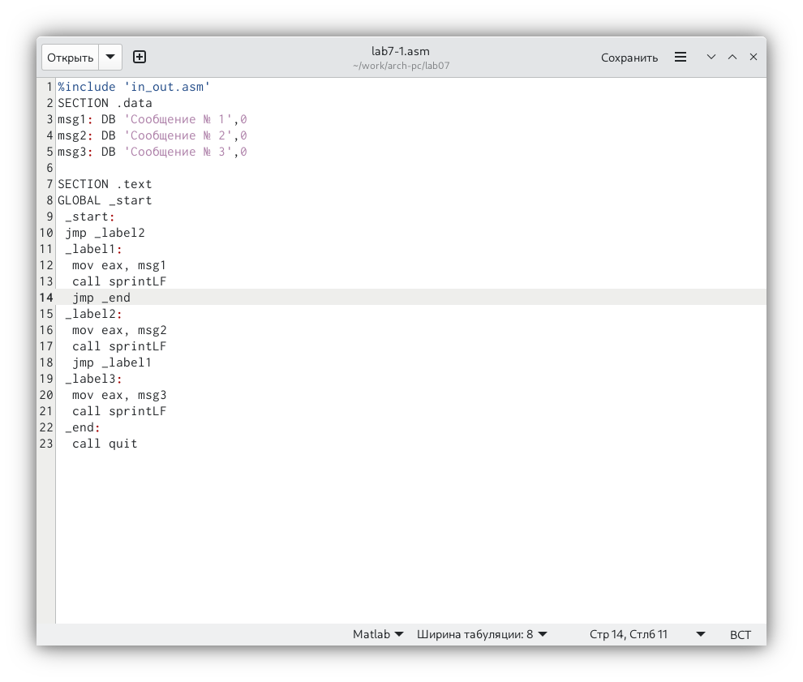{#fig:004 width=70%}

Работа изменённой программы(рис. @fig:005).

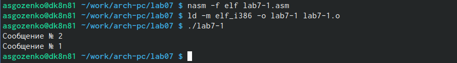{#fig:005 width=70%}

Написание программы из листинга 7.2(рис. @fig:006).

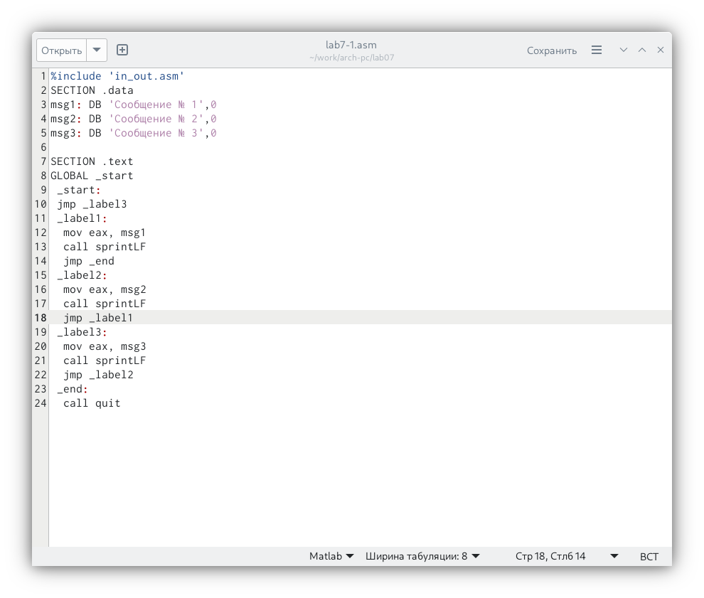{#fig:006 width=70%}

Работа программы из листинга 7.2(рис. @fig:007).

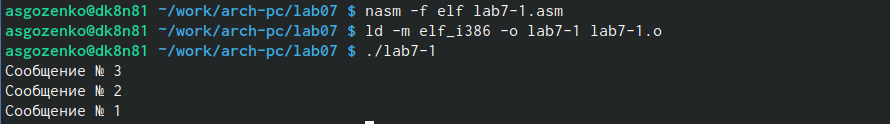{#fig:007 width=70%}

Написание программы lab7-2.asm из Листинга 7.3(рис. @fig:008).

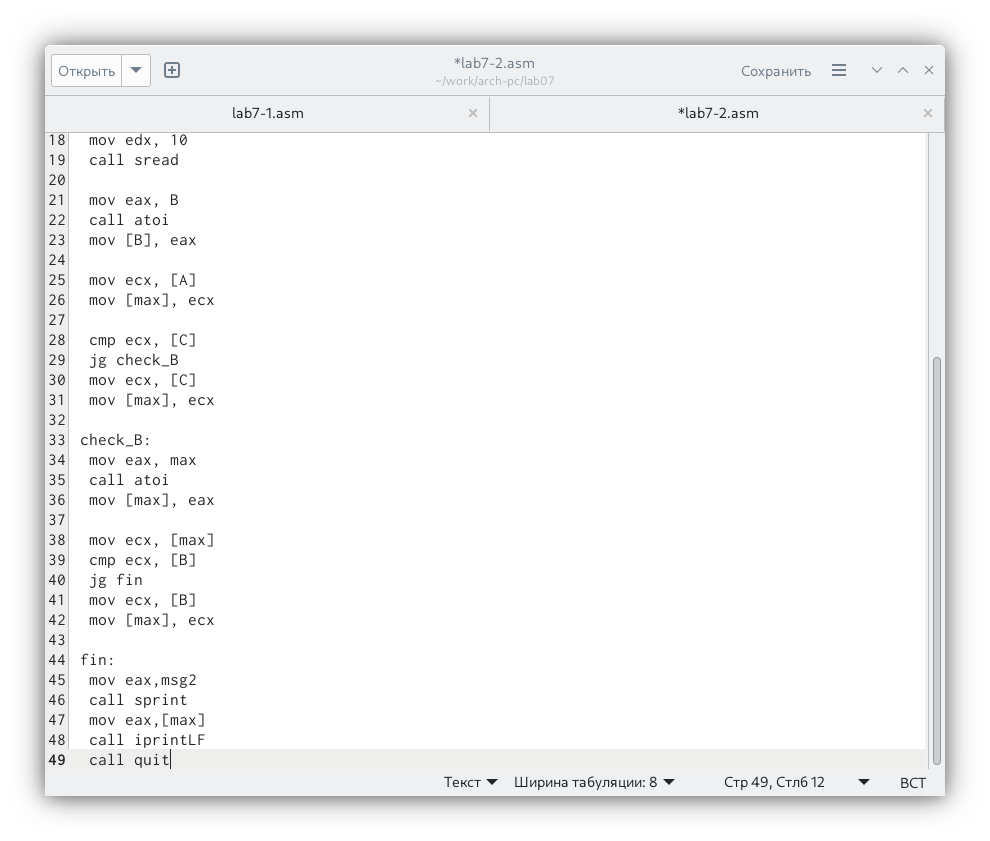{#fig:008 width=70%}

Создание файла и работа программы(рис. @fig:009).

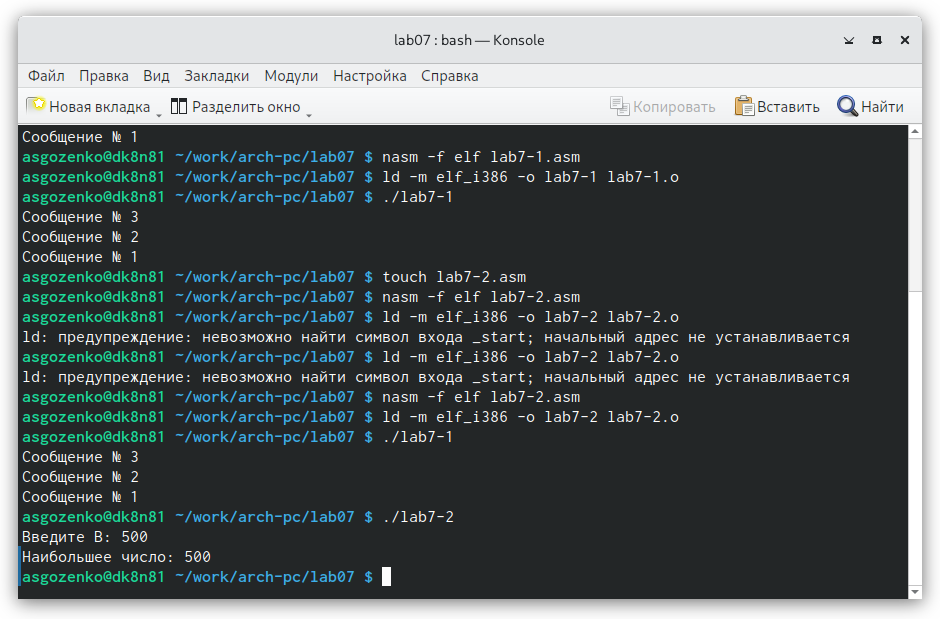{#fig:009 width=70%}

Создание файла листинга(рис. @fig:010).

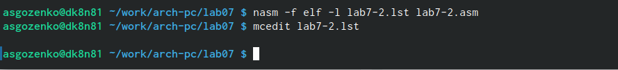{#fig:010 width=70%}

Файл листинга(рис. @fig:011).

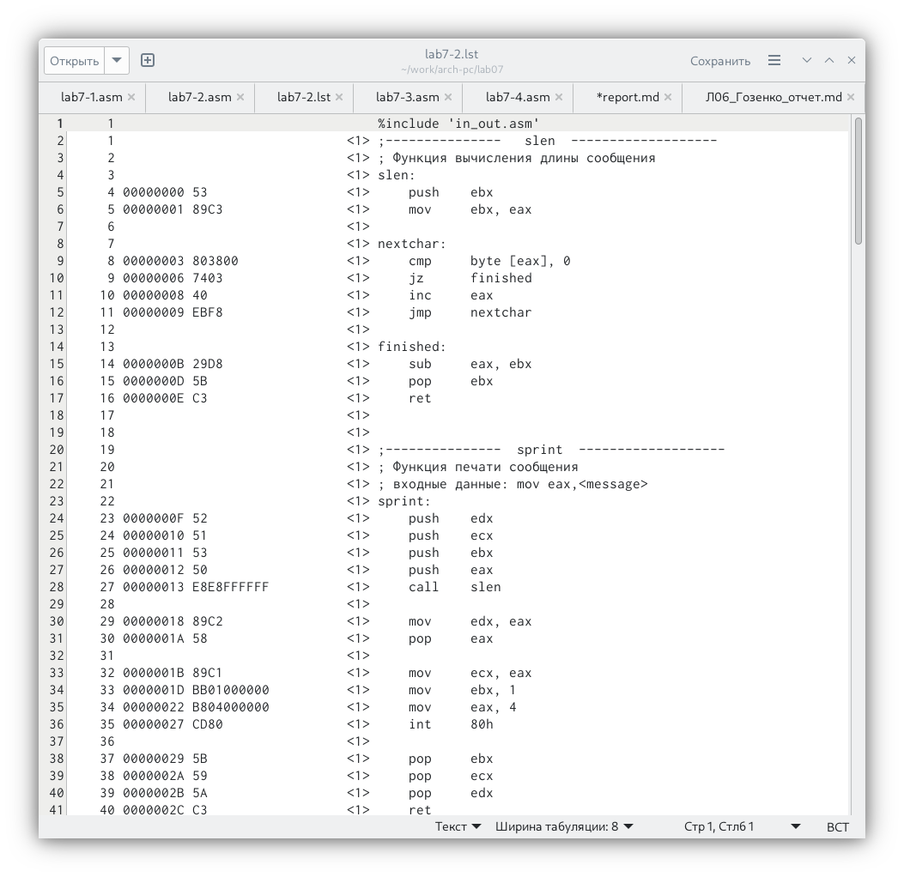{#fig:011 width=70%}
Рассмотрим файл листинга одной из программ. В строке 8 содержится номер строки [8], адрес[00000003], машинный код[803800] и содержимое строки кода[cmp byte [eax], 0]. В строке 10 содержится номер строки [10], адрес[00000008], машинный код[40] и содержимое строки кода[inc eax]. В строке 23 содержится номер строки [23], адрес[0000000F], машинный код[52] и содержимое строки кода[push edx].

Специально допущенная ошибка в коде программы(рис. @fig:012).

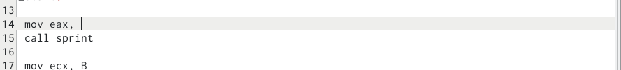{#fig:012 width=70%}

Реакция листинга на допущенную ошибку, добавляется описание ошибке в файле листинга(рис. @fig:013).

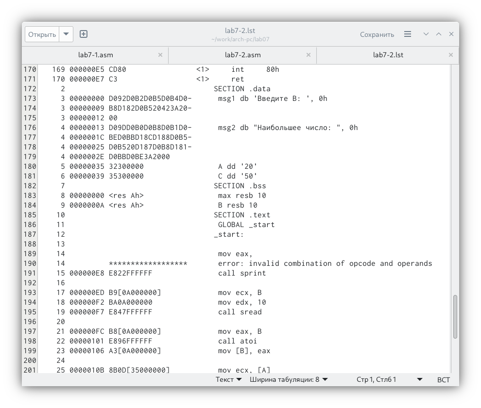{#fig:013 width=70%}

# Выполнение задания для самостоятельной работы. Вариант 13.

Написание программы для пункта 1 самостоятельной работы(рис. @fig:014).

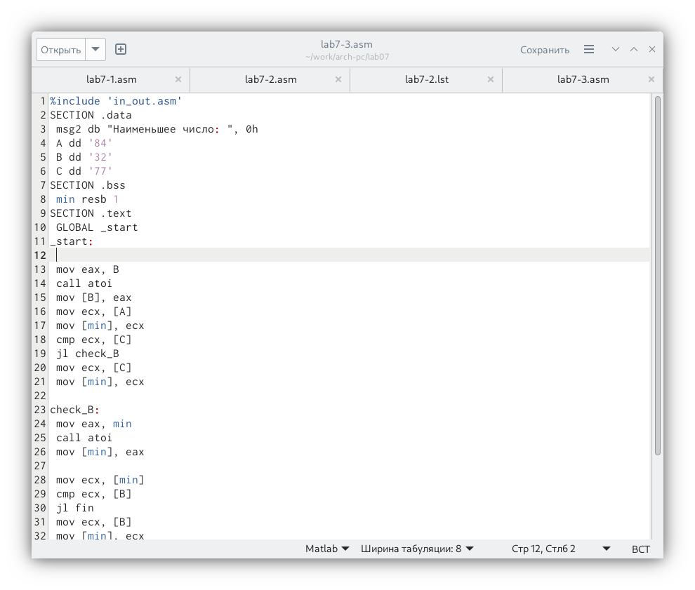{#fig:014 width=70%}

Проверка работы программы(рис. @fig:015).

{#fig:015 width=70%}

Код Программы из пункта 1:

%include 'in_out.asm'
SECTION .data
 msg2 db "Наименьшее число: ", 0h
 A dd '84'
 B dd '32'
 C dd '77'
SECTION .bss
 min resb 1
SECTION .text
 GLOBAL _start
_start:
 
 mov eax, B
 call atoi
 mov [B], eax
 mov ecx, [A]
 mov [min], ecx
 cmp ecx, [C]
 jl check_B
 mov ecx, [C]
 mov [min], ecx
  
check_B:
 mov eax, min
 call atoi
 mov [min], eax
  
 mov ecx, [min]
 cmp ecx, [B]
 jl fin
 mov ecx, [B]
 mov [min], ecx
  
fin:
 mov eax,msg2
 call sprint
 mov eax,[min]
 call iprintLF
 call quit

Написание программы для пункта 2 самостоятельной работы(рис. @fig:016).

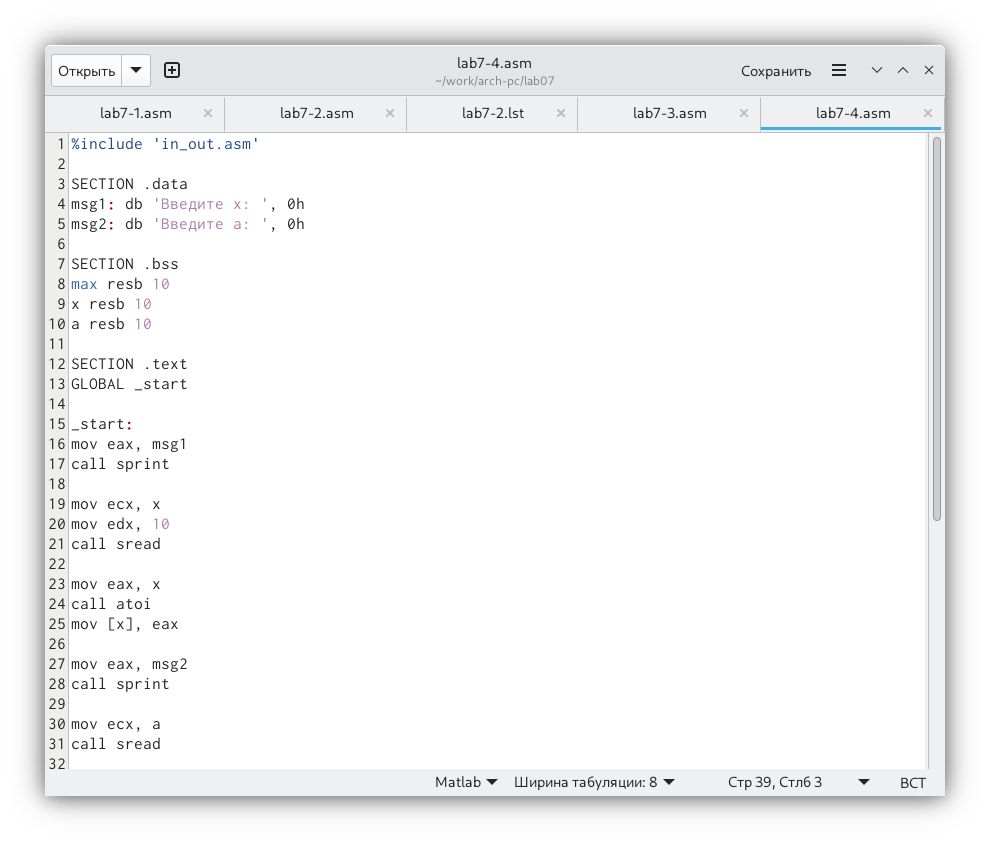{#fig:016 width=70%}

Проверка работы программы(рис. @fig:017).

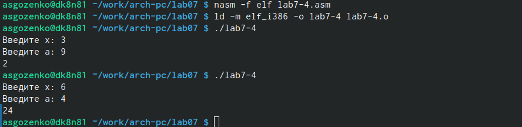{#fig:017 width=70%}

# Выводы

Я изучил команды усовного и безусовного переходов ассемблера NASM. Приобрёл навыки написание программ с использованием переходов.

