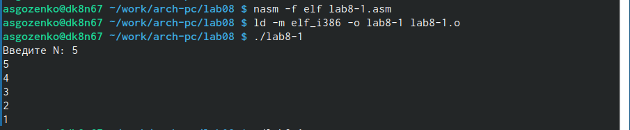
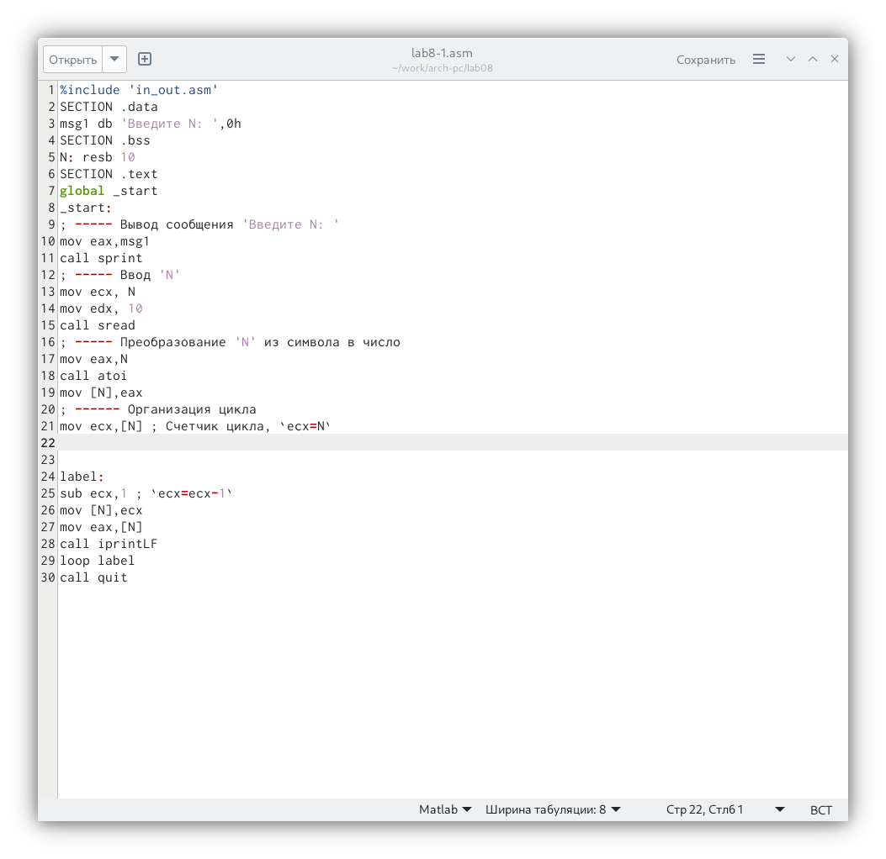
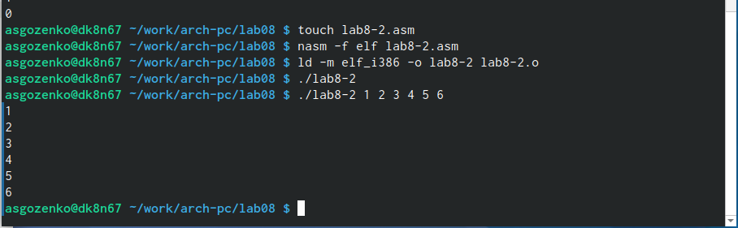

---
## Front matter
title: "Отчёт по Лабораторной работе №8"
subtitle: "Дисцилина: Архитектура компьютера"
author: "Гозенко А.С."

## Generic otions
lang: ru-RU
toc-title: "Содержание"

## Bibliography
bibliography: bib/cite.bib
csl: pandoc/csl/gost-r-7-0-5-2008-numeric.csl

## Pdf output format
toc: true # Table of contents
toc-depth: 2
lof: true # List of figures
lot: false # List of tables
fontsize: 12pt
linestretch: 1.5
papersize: a4
documentclass: scrreprt
## I18n polyglossia
polyglossia-lang:
  name: russian
  options:
	- spelling=modern
	- babelshorthands=true
polyglossia-otherlangs:
  name: english
## I18n babel
babel-lang: russian
babel-otherlangs: english
## Fonts
mainfont: PT Serif
romanfont: PT Serif
sansfont: PT Sans
monofont: PT Mono
mainfontoptions: Ligatures=TeX
romanfontoptions: Ligatures=TeX
sansfontoptions: Ligatures=TeX,Scale=MatchLowercase
monofontoptions: Scale=MatchLowercase,Scale=0.9
## Biblatex
biblatex: true
biblio-style: "gost-numeric"
biblatexoptions:
  - parentracker=true
  - backend=biber
  - hyperref=auto
  - language=auto
  - autolang=other*
  - citestyle=gost-numeric
## Pandoc-crossref LaTeX customization
figureTitle: "Рис."
tableTitle: "Таблица"
listingTitle: "Листинг"
lofTitle: "Список иллюстраций"
lotTitle: "Список таблиц"
lolTitle: "Листинги"
## Misc options
indent: true
header-includes:
  - \usepackage{indentfirst}
  - \usepackage{float} # keep figures where there are in the text
  - \floatplacement{figure}{H} # keep figures where there are in the text
---

# Цель работы

Получение навыков по организации циклов и работе со стеком на языке NASM.

# Выполнение лабораторной работы

Создаю каталог lab08 и файл lab8-1.asm (рис. @fig:001).

{#fig:001 width=70%}

Создаю файл с программой из листинга 1 (рис. @fig:002) и проверяю её работу (рис. @fig:003).

{#fig:002 width=70%}

{#fig:003 width=70%}

Вношу изменения в текст программы и проверяю её работу (рис. @fig:004).

{#fig:004 width=70%}

Вншу изменения в текст программы, чтобы выводились числа от 9 до 0 (рис. @fig:005) и проверяю её работу (рис. @fig:006).

{#fig:005 width=70%}

{#fig:006 width=70%}

Создаю файл с программой из листинга 2 (рис. @fig:007) и проверяю её работу (рис. @fig:008). Было обработано 6 аргументов.

{#fig:007 width=70%}

{#fig:008 width=70%}

Создаю файл с программой из листинга 3 (рис. @fig:009) и проверяю её работу (рис. @fig:010).

{#fig:009 width=70%}

{#fig:010 width=70%}

Вношу изменения в текст программы для вычисления произведения аргументов командной строки (рис. @fig:011) и проверяю её работу (рис. @fig:012).

{#fig:011 width=70%}

{#fig:012 width=70%}

# Выполнение задания для самостоятельной работы

Вариант 13

Создаю файл с программой которая выполняет условие (рис. @fig:013) и проверяю её работу (рис. @fig:014).

{#fig:013 width=70%}

{#fig:014 width=70%}

# Выводы

Были получены навыки по организации циклов и работе со стеком на языке NASM.
